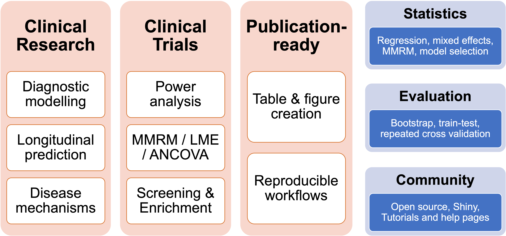

<!-- README.md is generated from README.Rmd. Please edit that file -->

# Automated biomarker analysis

<!-- badges: start -->

[](https://github.com/ncullen93/abaR/actions)
[](https://app.codecov.io/gh/ncullen93/abaR?branch=main)
<!-- badges: end -->

The goals of the aba package are the following:

-   to facilitate sound statistical modelling in clinical research
-   to provide advanced tools for biomarker-based planning of clinical
    trials
-   to generate publication-ready tables and figures



With the aba package, it becomes easier to fit statistical models on
permuatations of covariates / predictors / outcomes / groups, to make it
easier to investigate how biomarkers can be used to plan (screening /
enirichment) and analyze clinical trials, and to facilitate multi-cohort
validation studies when data cannot be easily shared between
collaborators.

## Getting started

To view tutorials and examples of how to use the package, you can visit
the package website at <https://ncullen93.github.io/abaR/>.

You can install the development version of the aba package from
[GitHub](https://github.com/ncullen93/abaR) with the following:

``` r
# install.packages("devtools")
devtools::install_github("ncullen93/abaR")
```

The general workflow of fitting an aba model for statistical analysis
looks like this:

``` r
library(aba)

df <- aba::adnimerge %>% filter(VISCODE == 'bl')

model_spec <- df %>% aba_model() %>%
  set_groups(everyone()) %>%
  set_outcomes(ConvertedToAlzheimers, CSF_ABETA_STATUS_bl) %>%
  set_predictors(
    PLASMA_ABETA_bl,
    PLASMA_PTAU181_bl,
    PLASMA_NFL_bl,
    c(PLASMA_ABETA_bl, PLASMA_PTAU181_bl, PLASMA_NFL_bl)
  ) %>%
  set_stats(
    stat_glm(std.beta=T)
  )

model_fit <- model_spec %>% fit()
model_summary <- model_fit %>% summary()
```

## Publications

Some publications whose analysis has been done partially or completely
with functions from the aba package are featured here:

-   [Individualized prognosis of cognitive decline and dementia in mild
    cognitive impairment based on plasma biomarker
    combinations](https://www.nature.com/articles/s43587-020-00003-5) NC
    Cullen, A Leuzy, S Palmqvist, S Janelidze, E Stomrud, P Pesini, et
    al. Nature Aging, 2021

-   [Prediction of future Alzheimer’s disease dementia using plasma
    phospho-tau combined with other accessible
    measures](https://www.nature.com/articles/s41591-021-01348-z) S
    Palmqvist, P Tideman, N Cullen, H Zetterberg, K Blennow, JL Dage, et
    al. Nature Medicine, 2021

-   [Plasma biomarkers of Alzheimer’s disease improve prediction of
    cognitive decline in cognitively unimpaired elderly
    populations](https://www.nature.com/articles/s41467-021-23746-0) NC
    Cullen, A Leuzy, S Janelidze, S Palmqvist, AL Svenningsson, et
    al. Nature Communications, 2021

-   [Comparing progression biomarkers in clinical trials of early
    Alzheimer’s
    disease](https://onlinelibrary.wiley.com/doi/full/10.1002/acn3.51158)
    NC Cullen, H Zetterberg, PS Insel, B Olsson, U Andreasson, et
    al. Annals of Clinical and Translational Neurology 7 (9), 1661-1673

### Cite

If you use the aba package in your work, we appreciate if you cite us.
An example statement which can be added at the end of the “Statistical
analysis” section of your methods is provided here:

> The analysis was done in the R programming language (v4.0.3) using the
> Automated Biomarker Analysis for R (“aba”) package \[citation\].

## Receiving help

The easiest way to get help is to create an issue on the github page or
to send us an email with your questions.
