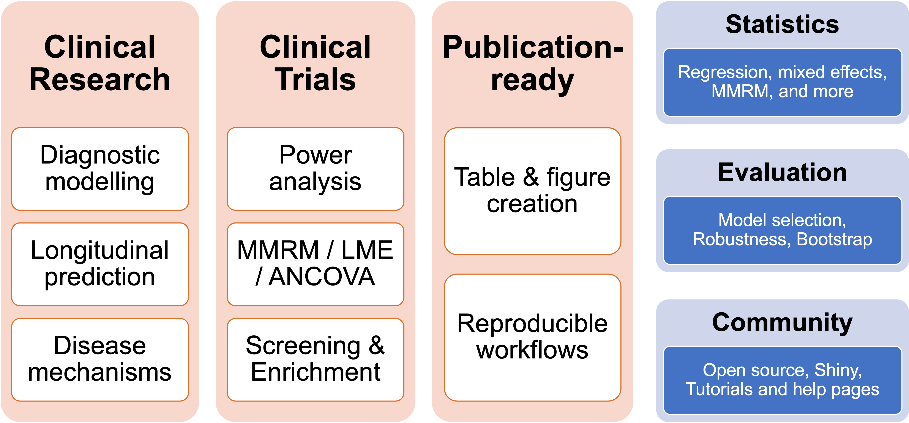

<!-- README.md is generated from README.Rmd. Please edit that file -->

# Automated biomarker analysis in R

<!-- badges: start -->

[](https://github.com/ncullen93/abaR/actions)
[](https://app.codecov.io/gh/ncullen93/abaR?branch=main)
<!-- badges: end -->

The goals of abaR are to do the following:

-   to make it easy to fit many statistical models
-   to provide high-level functions for common model visualizations
-   to improve workflows for biomarker-based planning and analysis of
    clinical trials
-   to facilitate multi-cohort validation studies without direct data
    sharing



With the abaR package, it becomes easier to fit statistical models on
permuatations of covariates / predictors / outcomes / groups, to make it
easier to investigate how biomarkers can be used to plan (screening /
enirichment) and analyze clinical trials, and to facilitate multi-cohort
validation studies when data cannot be easily shared between
collaborators.

The abaR package is based on tidyverse principles, which is why it
features a workflow heavily based on the pipe ( %&gt;% ) operator. This
lets you analyze data in a manner which is more similar to the way we
talk and think about biomarker analysis.

A meta-goal of the abaR framework is to cater to users at a wide range
of abstraction levels. This means that abaR should work equally well for
users whether they want a high-level framework to analyze biomarkers
without thinking much about the underlying statistics, or wether they
want a low-level framework where they just want a way to easily run
their own highly custom statistical models on different parameter
combinations and across cohorts.

## Installation

You can install the development version from
[GitHub](https://github.com/ncullen93/abaR) with:

``` r
# install.packages("devtools")
devtools::install_github("ncullen93/abaR")
```

## Statistical analysis

The general workflow of fitting an aba model for statistical analysis
looks like this:

``` r
library(aba)

df <- aba::adnimerge %>% filter(VISCODE == 'bl')

model_spec <- df %>% aba_model() %>%
  set_groups(everyone()) %>%
  set_outcomes(ConvertedToAlzheimers, CSF_ABETA_STATUS_bl) %>%
  set_predictors(
    PLASMA_ABETA_bl,
    PLASMA_PTAU181_bl,
    PLASMA_NFL_bl,
    c(PLASMA_ABETA_bl, PLASMA_PTAU181_bl, PLASMA_NFL_bl)
  ) %>%
  set_stats(
    stat_glm(std.beta=T)
  )

model_fit <- model_spec %>% fit()
model_summary <- model_fit %>% summary()
```
